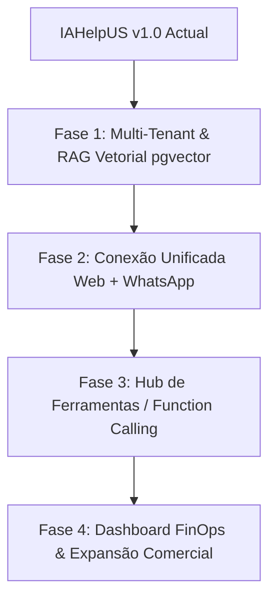

# 🧠 IAHelpUS - Arquitetura Estratégica & Roadmap Multissoluções

> **Versão**: 1.0.0  
> **Data**: Setembro / 2026  
> **Domínio de Produção**: [https://ai.helpusbr.com/](https://ai.helpusbr.com/)  
> **Repositório GitHub**: [https://github.com/HelpUSA/helpus-ai.git](https://github.com/HelpUSA/helpus-ai.git)  
> **Diretório Raiz**: `d:\dev\ai`

---

## 1. Visão Geral e Mapeamento do Ecossistema

O ecossistema **IAHelpUS** é a plataforma central de inteligência artificial da empresa, projetada para atender tanto a interface web interativa quanto os robôs de automação de atendimento.

### 📁 Estrutura de Pastas e Componentes

* **`d:\dev\ai`** *(Core da IAHelpUS)*:
  * **`frontend/`**: Aplicação Next.js (Turbopack + React + Tailwind CSS) com a interface `helpus-dark-shell`, Login Google, histórico de conversas, busca web e painel administrativo `/admin`.
  * **`backend/`**: Servidor de Inteligência com orquestração multi-modelo (`cerebro.py`), motor de memória evolutiva, guardas de execução e API REST.
  * **`scripts/`**: Suíte automatizada de testes smoke, validações de contrato e auditoria.
* **`d:\dev\helpus-whatsapp-ia`** *(Atendimento WhatsApp)*:
  * Servidor Express integrado à Meta Graph API v25.0 e OpenAI API para atendimento e qualificação de leads via WhatsApp.

---

## 2. Diagnóstico da Arquitetura Atual

A **IAHelpUS** já possui uma infraestrutura de nível enterprise:

1. **Roteamento Multi-Modelo Inteligente (`multi_ai_provider.py`)**:
   * Suporta o mapeamento de modelos por apelidos funcionais:
     * `helpus-fast`: Baixa latência para respostas diretas.
     * `helpus-general`: Conversação e atendimento geral.
     * `helpus-reasoner`: Raciocínio profundo e análise lógica.
     * `helpus-code`: Geração e auditoria de código.
     * `helpus-vision`: Processamento de imagens e documentos visuais.
     * `helpus-verifier`: Verificação de segurança e concisão.
     * `helpus-embedding`: Vetorização e busca semântica.
   * Suporta modos de operação avançados: `single`, `auto`, `review` (revisão cruzada) e `council` (conselho de IAs).

2. **Motor de Memória Evolutiva (`evolving_memory_store.py`)**:
   * Sistema de aprendizado contínuo que extrai lições das conversas, promove regras operacionais e injeta o contexto dinâmico no prompt do sistema.

3. **Governança & Portões de Segurança (`helpus_approval_gate.py`)**:
   * Sistema de aprovação humana (*Human-in-the-loop*), simulação seca (*dry-run*), execução restrita a modo somente-leitura e envelopes de auditoria.

4. **Deploy de Alta Disponibilidade**:
   * Frontend hospedado na **Vercel** (`ai.helpusbr.com`).
   * Backend e serviços de memória preparados para a **Railway** (`railway.json` e `Dockerfile`).

---

## 3. Plano de Evolução Multissoluções (White-Label / Core AI)

Para permitir que a **IAHelpUS** sirva como o cérebro central para múltiplos produtos e clientes da empresa (ex: HelpUS E-commerce, WagnerDriver, Katia Xavier, Clínicas, etc.), são recomendadas as seguintes 5 evoluções estratégicas:

### 3.1. Arquitetura Multi-Tenant (`tenant_id` / `workspace_id`)
* **Objetivo**: Permitir que múltiplos clientes ou projetos utilizem a mesma infraestrutura da IAHelpUS sem cruzamento de dados.
* **Implementação**:
  * Adicionar a coluna `tenant_id` nas tabelas de histórico, memória evolutiva e regras no PostgreSQL.
  * Isolar o contexto de cada chamada com base no token de autenticação ou cabeçalho `X-Tenant-ID`.

### 3.2. Unificação Omnichannel (Web + WhatsApp em Backend Único)
* **Objetivo**: Fazer o robô do WhatsApp (`helpus-whatsapp-ia`) consumir a API da IAHelpUS (`helpus-ai`).
* **Implementação**:
  * Integrar o webhook do WhatsApp como um cliente da API da IAHelpUS.
  * **Resultado**: Se um cliente conversar pelo site `ai.helpusbr.com` e depois mandar mensagem no WhatsApp, a IA lembrará de todo o histórico do cliente.

### 3.3. RAG Híbrido com Banco Vetorial (`pgvector` no PostgreSQL)
* **Objetivo**: Permitir que a IA consulte documentos técnicos, PDFs, manuais e catálogos com precisão cirúrgica.
* **Implementação**:
  * Ativar a extensão `pgvector` no banco PostgreSQL.
  * Ingerir documentos usando o alias `helpus-embedding` para busca semântica de alta relevância.

### 3.4. Hub de Ferramentas / Conectores de Ações (*Tool Plugin Registry*)
* **Objetivo**: Dar à IA a capacidade de executar ações reais em sistemas externos.
* **Ferramentas sugeridas**:
  * 💳 **Pagamentos**: Emissão de Pix e links de pagamento (Asaas / Mercado Pago).
  * 📅 **Agendamento**: Marcação de horários no Google Calendar / CRM.
  * 💬 **Notificações**: Alertas para a equipe de atendimento humano via WhatsApp ou e-mail.
  * 📦 **E-commerce**: Consulta de status de pedidos no `helpus-site`.

### 3.5. Telemetria FinOps & Métricas de Custo
* **Objetivo**: Monitorar o custo exato de API por modelo, por usuário e por tenant.
* **Implementação**:
  * Expandir o painel administrativo `/admin` para exibir gráficos de consumo financeiro (USD/BRL), latência média e taxa de fallback dos provedores.

---

## 4. Roadmap de Execução (Fases)

| Fase | Escopo Principal | Entrega Chave |
| :--- | :--- | :--- |
| **Fase 1** | Multi-Tenancy & RAG Vetorial | Suporte a `tenant_id` e busca semântica em PDFs/documentos no PostgreSQL (`pgvector`). |
| **Fase 2** | Integração Omnichannel | Unificação do `helpus-whatsapp-ia` ao cérebro da IAHelpUS. |
| **Fase 3** | Hub de Ferramentas (*Tools*) | Ações automáticas (Pix, Agendamentos, Consultas no banco). |
| **Fase 4** | Dashboard FinOps | Controle financeiro de tokens e custos de IA por cliente no `/admin`. |

---

## 5. Conclusão e Próximos Passos

A **IAHelpUS** já possui os alicerces mais complexos prontos (memória evolutiva, roteamento multi-modelo, guardas de segurança e auditoria). A implementação do roteiro acima garantirá que ela se torne a plataforma proprietária de inteligência artificial escalável para todos os negócios da empresa.
